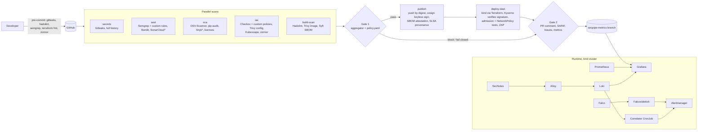

# SecPipe: automated DevSecOps CI/CD security gate

SecPipe is a drop-in GitHub Actions pipeline that scans every commit for
secrets, code flaws, vulnerable dependencies, container CVEs, IaC and
Kubernetes misconfigurations and runtime web vulnerabilities, deduplicates and
scores everything in one Python aggregator, and **blocks the merge or deploy**
when `policy/policy.yaml` says so. It ships with a purpose-built target app
(SecNotes: secure on `main`, 14 planted flaws on `vulnerable`), a Terraform
environment, a hardened Kubernetes deployment guarded by Kyverno, keyless
image signing, and a runtime layer (Falco, Loki, a log correlator, runbooks)
so build-time and run-time risk end up on one Grafana dashboard.

<!-- Demo GIF: record steps 1 and 3 of the demo (blocked PR, unsigned image rejected) -->

## Architecture


<sub>* optional, enabled by a token secret</sub>

The eight layers:

1. **Developer:** pre-commit hooks (Gitleaks, Hadolint, Semgrep, `terraform fmt`, zizmor, ruff).
2. **CI orchestration:** one reusable workflow, nine jobs, least-privilege tokens, every action pinned by SHA.
3. **Scanning:** independent jobs per stage; every scanner leaves a report and a `.meta.json` sidecar.
4. **Decision:** the `secpipe` aggregator: parse, normalise, deduplicate, enrich (EPSS, CISA KEV), diff against the base branch, apply `policy.yaml`, exit 0 / 1 / 2.
5. **Artifact:** GHCR by digest, Cosign keyless signature (Rekor), CycloneDX SBOM attestation, GitHub build provenance.
6. **Infrastructure:** Terraform `local` (kind + Calico + API audit log) and `aws` (OIDC roles, ECR, encrypted reports bucket, budget).
7. **Cluster:** Pod Security Admission `restricted`, Kyverno (5 policies incl. signature verification), default-deny NetworkPolicies, token-less service accounts.
8. **Runtime and response:** Falco, Alloy + Loki, Prometheus rules, correlator, Alertmanager routing, runbooks, quarantine script, drill.

## What SecPipe catches

The `vulnerable` branch is `main` plus 14 planted flaws ([threat model](docs/threat-model.md)).
It is never merged; its pull request exists to show the gate blocking.

| # | Flaw | Caught by | Stage |
| --- | --- | --- | --- |
| 1 | Fake AWS key + DB password in code and git history | Gitleaks (+ custom rules) | Secrets |
| 2 | SQL built with an f-string | Semgrep (custom taint rule), Bandit, ZAP active scan | SAST, DAST |
| 3 | IDOR on `GET /notes/{id}` | Custom Semgrep heuristic (`secnotes-possible-idor`); confirmation needs manual review | SAST, manual |
| 4 | JWT signature verification off, secret `secret123` | Semgrep (custom), Gitleaks (custom) | SAST, Secrets |
| 5 | `yaml.load` on uploads | Semgrep (custom), Bandit | SAST |
| 6 | SSRF in link previews | Semgrep (custom taint rule) | SAST |
| 7 | `subprocess` with `shell=True` | Bandit, Semgrep | SAST |
| 8 | MD5 password hashing | Semgrep (custom), Bandit | SAST |
| 9 | Old libraries (PyYAML 5.3.1, PyJWT 2.3.0, ...) | pip-audit, OSV-Scanner, Trivy (KEV/EPSS enrichment) | SCA, Container |
| 10 | CORS `*` with credentials, debug tracebacks, no headers | Semgrep (custom), ZAP baseline | SAST, DAST |
| 11 | No failed-login logging, no rate limit | Not scanner-detectable (by design); covered by tests and the runtime rules | Manual |
| 12 | Root user, EOL base, secret in `ENV`, `ADD .` | Hadolint, Trivy (image + config), Checkov | Container |
| 13 | Public S3 bucket, SSH from `0.0.0.0/0`, IAM `*`, mutable ECR, `repo:owner/*` OIDC trust | Checkov (+ `CKV2_SECPIPE_1`, `CKV_SECPIPE_2`), Trivy config | IaC |
| 14 | Privileged, root, `:latest`, no limits | Kubescape, Checkov, Kyverno + PSA at admission | IaC, Cluster |

Detection counts per run are in [docs/triage-log.md](docs/triage-log.md).

## Quick start

Prerequisites: Python 3.12, Docker, git; for the cluster also Terraform,
kubectl, kind and Helm (`scripts/bootstrap.sh` checks them).

```bash
make setup          # hash-locked dev venv + pre-commit hooks
make test           # app and aggregator tests (coverage gate 85%)
make scan gate      # every scanner exactly as CI runs it, then the gate
make up             # SecNotes + Postgres with docker compose (secrets as files)

make cluster        # kind (Terraform) + Calico + Kyverno + cert-manager + Traefik
make deploy         # build, load and deploy SecNotes (https://secnotes.localtest.me:8443)
make monitoring     # Prometheus, Grafana, Loki, Alloy, Falco, exporter, correlator
make demo           # admission rejections, attack drill, quarantine
make teardown
```

## Adopting SecPipe in another repository

```yaml
jobs:
  security:
    uses: Weasley18/SecPipe/.github/workflows/secpipe-reusable.yml@<commit-sha>
    permissions: {contents: read, actions: read, packages: write, id-token: write,
                  attestations: write, pull-requests: write, security-events: write, issues: write}
    with:
      app-path: src
      requirements: requirements.txt
      dockerfile: Dockerfile
      policy-file: security/policy.yaml   # optional, defaults to SecPipe's
      enable-dast: false                  # true needs a kustomize overlay (k8s-overlay)
      secpipe-ref: <commit-sha>           # the tooling version, pin it
    secrets:
      SNYK_TOKEN: ${{ secrets.SNYK_TOKEN }}
```

The gate job is named `secpipe-gate`: make it a required status check.
`scripts/configure-branch-protection.sh` sets that up for `main`, together
with code-owner review (see `.github/CODEOWNERS`) and push protection.

## Policy reference

Everything the gate decides is in [`policy/policy.yaml`](policy/policy.yaml),
validated against [a JSON Schema](secpipe/aggregator/policy.schema.json)
(`secpipe policy validate`); scanner flags never decide ([ADR 0002](docs/adr/0002-policy-as-code.md)).

- **Thresholds:** `block_at_or_above` / `warn_at_or_above`, stricter on `main` (medium) than elsewhere (high).
- **Always block:** secrets (`always_block_categories`), and any CVE on the CISA KEV list (`block_if_in_kev`, even without a fix).
- **Escalation:** EPSS above `epss_bump_threshold` (0.1) bumps severity one level.
- **Pull requests:** only findings new against the base branch block (`only_new_findings_block_prs`); existing ones warn.
- **Licences:** deny list (AGPL-3.0, SSPL-1.0, GPL-3.0, BUSL-1.1) and allow list; unknown licences warn.
- **SLAs:** critical 7 days, high 30, medium 90, low 180; Issues on `main` carry the due date.
- **Exceptions:** by fingerprint or rule + path, with `reason`, `owner` and `expires`:
  ```yaml
  exceptions:
    - rule: B608
      path: "app/src/secnotes/legacy/*"
      reason: "only bound parameters reach this query; tracked in #42"
      owner: "@Weasley18"
      expires: 2026-12-31
  ```
  An expired exception fails the gate; one expiring within 14 days warns.
- **In-code suppressions** (`# nosec`, `# nosemgrep`, `checkov:skip`, `trivy:ignore`, ...)
  need a written justification, and more than 3 new ones in a PR need the
  `secpipe:suppressions-approved` label.

## Results

> Numbers here are only ones measured from real runs; see the linked runs.

_Filled in from the CI runs of `main` and the `vulnerable` pull request._

## Limitations and known gaps

- **IDOR and business logic** need manual review: the custom Semgrep rule flags
  suspicious lookups, but confirming broken access control is a human job (flaw #3).
- **Missing logging/rate limiting** (flaw #11) is invisible to scanners; it is
  covered by unit tests and by the runtime detections instead.
- **DAST coverage depends on the OpenAPI document**; endpoints missing from it
  are only spidered. ZAP's API scan is capped at 8 minutes per PR; the full
  scan runs nightly.
- **kind is not production:** single control plane, local-path storage, no
  etcd encryption at rest; kube-bench findings on kind are expected. The node
  image is pinned to Kubernetes 1.35 because of the Terraform kind provider
  ([ADR 0007](docs/adr/0007-aws-profile-cost-tradeoffs.md)).
- **Kyverno `ClusterPolicy`** is deprecated in 1.19 in favour of CEL policies;
  migration is future work ([ADR 0004](docs/adr/0004-kyverno-over-gatekeeper.md)).
- **The gate runs the PR's own workflow and scripts.** A PR can change them;
  branch protection, required checks and CODEOWNERS on `.github/`, `scripts/ci/`
  and `policy/` are what keep that honest.
- **Optional integrations** (Snyk, SonarCloud, DefectDojo, AWS plan/apply) run
  only when their secrets or variables are configured.
- **Manual validation** (Burp Suite, Wireshark) and the recorded drill are
  documented procedures; their results are recorded in the triage log and
  `docs/incidents/` only once performed.

## Documentation

- [Threat model (STRIDE)](docs/threat-model.md)
- [Triage log](docs/triage-log.md): every finding, true or false positive, with evidence
- [Runbooks](docs/runbooks/README.md) (NIST SP 800-61)
- [Drill report](docs/incidents/drill-01.md)
- [Architecture decision records](docs/adr/README.md)
- [Parser fixtures and their provenance](secpipe/tests/fixtures/README.md)
