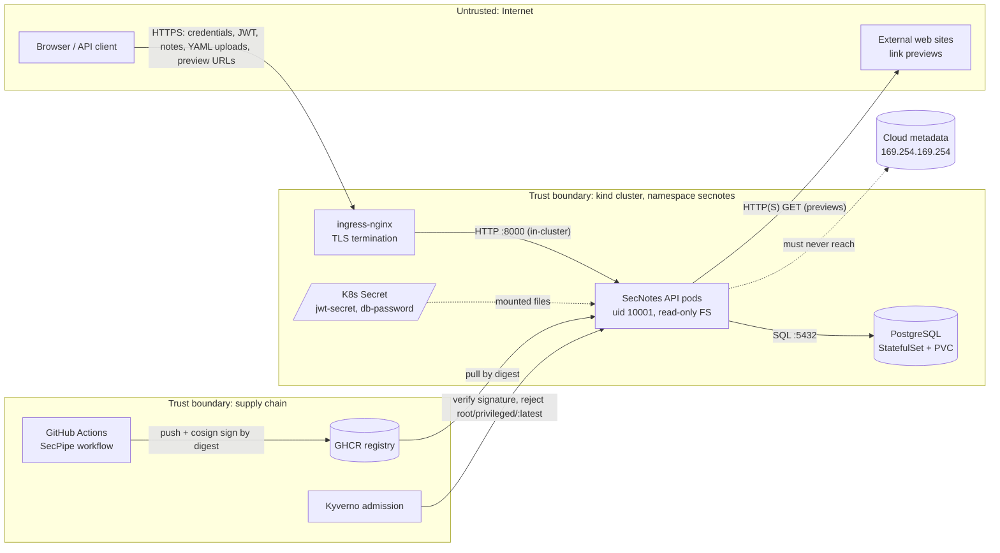

# SecNotes threat model (STRIDE)

| | |
|---|---|
| **System** | SecNotes API (FastAPI + PostgreSQL) as deployed by SecPipe |
| **Method** | Data-flow diagram, then STRIDE per element, then mitigations mapped to the planted-flaw table |
| **Written** | Before any flaw was planted on the `vulnerable` branch, so every planted flaw is a threat identified here |
| **Review** | Re-review on any new endpoint, new data store, new external call or change to a trust boundary |

## 1. Scope and assets

| Asset | Why it matters | Where it lives |
|---|---|---|
| Note contents | Private user data; confidentiality is the product's whole promise | `notes` table |
| Credentials | Password hashes (argon2id), TOTP secrets | `users` table |
| JWT signing key | Anyone holding it can mint admin tokens | K8s Secret mounted as a file (`/run/secrets/secnotes/jwt-secret`) |
| Refresh-token records | Rotation state; theft detection | `refresh_tokens` table |
| DB password | Direct database access | K8s Secret, mounted into API and Postgres |
| Container image | Whatever runs in the cluster | GHCR, signed with Cosign keyless |
| CI identity | Can push and sign images, assume the AWS role | GitHub OIDC token (short-lived) |
| Cloud metadata endpoint | Node credentials if reachable from a pod | `169.254.169.254` |

Out of scope: the GitHub platform itself, the Sigstore public-good infrastructure, host kernel exploits.

## 2. Data-flow diagram

Trust boundaries crossed by data:

1. **Internet to ingress**: every request is attacker-controlled until authenticated.
2. **Ingress to API**: the only ingress path allowed by NetworkPolicy (`allow-ingress-to-api`).
3. **API to Postgres**: the only egress the API needs besides DNS (`allow-api-to-db`, `allow-dns`).
4. **API to external URLs**: the preview feature deliberately crosses outwards, which is what makes SSRF possible.
5. **CI to registry to cluster**: code becomes an image; only images signed by this repository's workflow identity are admitted.

## 3. STRIDE per element

Planted flaw numbers refer to the table in the README ("What SecPipe catches") and the spec.

### 3.1 External entity: API client

| STRIDE | Threat | Mitigation on `main` | Flaw |
|---|---|---|---|
| **S**poofing | Forged JWT: `alg: none`, algorithm switching, weak HMAC key brute-forced offline, missing `aud`/`exp` checks | `algorithms=["HS256"]` pinned; key must be >= 32 bytes or the app refuses to start; `exp`, `nbf`, `iat`, `aud`, `iss`, `jti`, `typ` all required | #4 |
| Spoofing | Credential stuffing / password guessing | argon2id hashes; `slowapi` 5/minute on `/auth/login`; structured `login_failed` events feed the correlator; optional TOTP MFA for admins | #8, #11 |
| **R**epudiation | Attacker brute-forces login and nobody can prove it | Every failed and successful login logged as JSON with username, IP, user agent and token id; shipped to Loki; correlator raises "brute force" and "brute force then success" alerts | #11 |
| **D**enial of service | Unlimited login attempts, huge YAML imports, oversized bodies | Rate limits; 1 MiB request cap enforced in middleware; 256 KiB / 500-note import cap; container CPU/memory limits | #11, #14 |

### 3.2 Process: SecNotes API

| STRIDE | Threat | Mitigation on `main` | Flaw |
|---|---|---|---|
| **T**ampering | SQL injection through `/notes/search?q=` | SQLAlchemy expressions with bound parameters; LIKE wildcards escaped; search scoped to the caller | #2 |
| Tampering | Malicious YAML import (`!!python/object/apply:os.system`) giving code execution | `yaml.safe_load` then Pydantic schema validation with `extra="forbid"` | #5 |
| **I**nformation disclosure | IDOR: user A reads user B's note by changing the id | Every note query filters `owner_id == current_user.id`; foreign ids return 404, indistinguishable from missing ones | #3 |
| Information disclosure | SSRF from `/preview` to cloud metadata, Postgres or other in-cluster services | Scheme/port/host allow-list; every resolved address must be public unicast; redirects re-validated; egress NetworkPolicy; Falco egress rule | #6 |
| Information disclosure | Stack traces, SQL, paths in error responses | `debug=False`; middleware converts unhandled errors to a generic 500 with a request id; 422s never echo submitted values | #10 |
| Information disclosure | Browser-side data theft via permissive CORS | Explicit origin list, `*` rejected at startup, credentials only for listed origins | #10 |
| Information disclosure | Secrets in code or image layers | No secret defaults; secrets read from mounted files; image built from an allow-list context with no `ENV` secrets | #1, #12 |
| **E**levation of privilege | Command injection in admin export | Tarball built in memory with `tarfile`; no shell, no subprocess; filename validated by regex and only used in a header | #7 |
| Elevation of privilege | Self-registration as admin (mass assignment) | Request models forbid unknown fields; `role` is not accepted; admins are created only via `python -m secnotes.manage` | (design) |
| Elevation of privilege | Container escape after RCE | Non-root UID 10001, read-only root FS, all capabilities dropped, `allowPrivilegeEscalation: false`, seccomp `RuntimeDefault`, no service-account token | #12, #14 |

### 3.3 Data store: PostgreSQL

| STRIDE | Threat | Mitigation |
|---|---|---|
| Tampering / Information disclosure | Any pod in the cluster connects to Postgres | `allow-api-to-db`: Postgres accepts ingress only from API pods |
| Information disclosure | Stolen password hashes cracked offline | argon2id (memory-hard) with per-hash salt | 
| Repudiation | Changes cannot be attributed | App-level audit events (`export_created`, `user_registered`, `mfa_enabled`) with user id and request id |

### 3.4 Data flow: API to external URLs (previews)

| STRIDE | Threat | Mitigation |
|---|---|---|
| Information disclosure | DNS rebinding: an allow-listed name resolves to a private IP at connect time | Allow-list keeps the attack surface to named hosts; NetworkPolicy blocks egress to the pod and service CIDRs; Falco `SecNotes API unexpected outbound connection` fires on any egress besides Postgres and DNS. **Accepted residual risk**, documented in `ssrf.py` |
| Denial of service | Slow-loris upstream or huge pages | 3 s timeout, 512 KiB read cap, 3 redirects max |

### 3.5 Supply chain: CI, registry, cluster

| STRIDE | Threat | Mitigation |
|---|---|---|
| Spoofing | Unsigned or foreign image deployed | Kyverno `verify-secnotes-signature`: keyless Cosign signature from `https://github.com/Weasley18/SecPipe/.github/workflows/*`, issuer `token.actions.githubusercontent.com`, recorded in Rekor |
| Tampering | Tag re-pointed after scanning | Deploy by digest only; ECR tags immutable; `disallow-latest-tag` |
| Tampering | Compromised third-party action or dependency | Actions pinned to commit SHAs; `pip install --require-hashes`; Dependabot; SBOM attested to every image |
| Elevation of privilege | Fork PR steals secrets or pushes images | No `pull_request_target`; forks get no secrets and skip `publish`; least-privilege `permissions` per job |
| Elevation of privilege | Any branch or fork can assume the AWS role | OIDC trust policy pins `sub` to `repo:Weasley18/SecPipe:ref:refs/heads/main` / `environment:aws-demo`; custom Checkov check `CKV_SECPIPE_2` fails wildcards | #13 |
| Elevation of privilege | Privileged or root workload admitted | Pod Security Admission `restricted`, Kyverno `require-non-root`, `disallow-privileged`, `require-limits` | #14 |

## 4. Threats scanners will not find

These are called out on purpose. They need secure code review, manual testing or runtime detection:

- **IDOR (#3)**: pattern tools cannot know the ownership rule. Covered by the custom Semgrep heuristic `secnotes-possible-idor`, a unit test (user B gets 404) and a manual Burp check in `docs/triage-log.md`.
- **Missing security logging and rate limiting (#11)**: absence of code is invisible to SAST. Covered by unit tests and the correlator's brute-force rules.
- **DNS rebinding** in previews: needs runtime controls (NetworkPolicy, Falco).
- **Business-logic abuse** such as import spam: rate limits and size caps, reviewed manually.

## 5. Mapping to the planted flaws

| # | Flaw | STRIDE | Section |
|---|---|---|---|
| 1 | Hard-coded AWS key and DB password | Information disclosure | 3.2 |
| 2 | SQL injection in search | Tampering | 3.2 |
| 3 | IDOR on `GET /notes/{id}` | Information disclosure | 3.2 |
| 4 | JWT verification off, weak secret | Spoofing | 3.1 |
| 5 | `yaml.load` on uploads | Tampering / EoP | 3.2 |
| 6 | SSRF in `/preview` | Information disclosure | 3.2, 3.4 |
| 7 | `shell=True` in admin export | Elevation of privilege | 3.2 |
| 8 | MD5 password hashing | Spoofing / Information disclosure | 3.1, 3.3 |
| 9 | Vulnerable pinned libraries | Tampering (supply chain) | 3.5 |
| 10 | CORS `*` + credentials, debug tracebacks, no headers | Information disclosure | 3.2 |
| 11 | No failed-login logging, no rate limit | Repudiation / DoS | 3.1 |
| 12 | Root, EOL base, secret in `ENV` | Elevation of privilege / Information disclosure | 3.2 |
| 13 | Public S3, `0.0.0.0/0` SSH, IAM `*`, wildcard OIDC `sub` | Elevation of privilege / Information disclosure | 3.5 |
| 14 | Privileged pod, no limits, `:latest` | Elevation of privilege / DoS | 3.5 |
